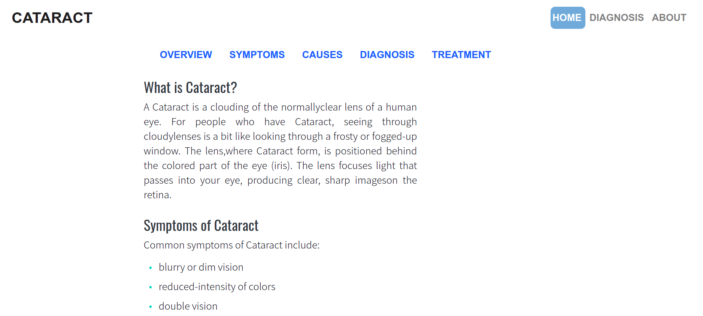

# Cataract-Detection-Flask-app
This is a simple app build using flask framework to serve the CNN model which can detect Cataract.

You can check out the live version [here](https://cataract-detection-flask-app.herokuapp.com/)